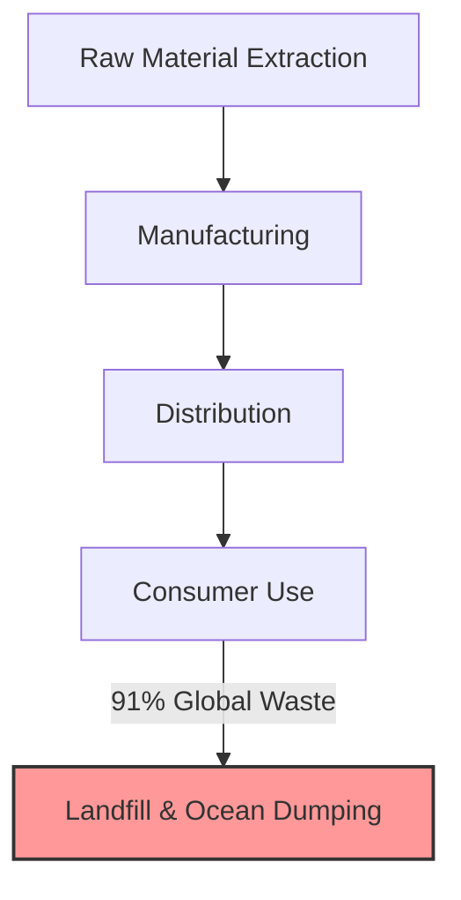
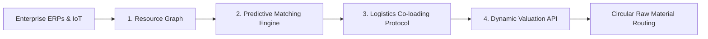
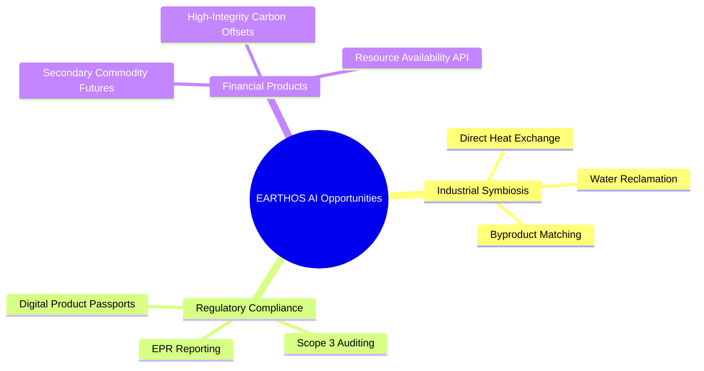

# EARTHOS AI: The Operating System for Earth's Resources
### A Strategic Blueprint and Product Research Document
*Prepared by the Founding Team*

---


---

## 1. Vision
**"A world of dynamic material abundance where 'waste' is obsolete."**

We envision a planet where every molecule, byproduct, and physical asset is cataloged, valued, and dynamically routed in real-time. Just as computer operating systems manage CPU, memory, and storage to prevent idle capacity and system failures, **EARTHOS AI** acts as the orchestration layer for the physical world—managing the lifecycle and routing of physical resources to ensure they are perpetually utilized at their highest economic and ecological value.

---

## 2. Mission
**"To ensure that nothing useful ever becomes waste."**

EARTHOS AI is building the data, logistics, and transactional infrastructure required to transition global supply chains from linear pipelines into interconnected, closed-loop systems. By treating waste not as a physical inevitability but as a **data routing failure**, we programmatically map, match, and transport underutilized materials back into the productive economy.

---

## 3. Problem Statement

Modern industrial supply chains suffer from systemic inefficiencies that force valuable resources into landfills:



*   **Information Asymmetry (The Visibility Gap):** Industrial facilities produce hundreds of tons of process byproducts (e.g., slag, spent solvents, waste heat, organic pulp) daily. Because there is no central registry for raw material state and location, finding another business that can use these byproducts as raw inputs is a manual, expensive, and often impossible task.
*   **The Transactional & Matching Friction:** Traditional commodity brokers are slow, require large manual contracts, and only deal with highly standardized materials. Low-grade, irregular, or localized byproducts lack the transaction infrastructure to be traded efficiently.
*   **Logistics Dissymmetry (The Co-loading Problem):** Even when a buyer and seller are matched, the cost of moving low-density, distributed, or hazardous secondary materials from Point A to Point B often exceeds the material's market value.
*   **Regulatory & Quality Compliance Barriers:** Stringent environmental regulations (such as cross-border waste classifications) and a lack of verified material composition data deter manufacturers from substituting virgin raw materials with secondary inputs.

---

## 4. Solution: The Earth's Resource OS

EARTHOS AI is not a recycling application. It is an **AI-powered Operating System** consisting of four core architectural pillars that run silently in the background of global supply chains:



### I. The Resource Graph
A semantic, real-time ledger that catalogs materials at their source. It ingests telemetry from corporate ERPs, warehouse management systems, and smart factory sensors to represent physical materials as stateful software objects with attributes like:
*   **Chemical composition / purity**
*   **Physical state (solid, liquid, thermal output)**
*   **Geographic coordinates**
*   **Temporal availability (when the byproduct will be generated)**

### II. The Predictive Matching Engine
A machine learning engine that scans the Resource Graph and cross-references it with downstream manufacturing demand. Instead of waiting for users to browse a marketplace, the engine autonomously runs predictive matches (e.g., matching a brewery's spent grain with a local biotechnology firm's growth media requirements or an automotive plant's plastic trimmings with a packaging manufacturer).

### III. The Logistics Co-loading Protocol
A multi-modal routing engine that algorithmically bundles the transport of secondary materials. By consolidating collection routes and co-loading compatible materials on return-trip logistics (backhauls), EARTHOS AI drives transport costs down to a level where circular routing becomes cheaper than landfill disposal.

### IV. The Dynamic Valuation API
A pricing engine that calculates the real-time value of secondary inputs, factoring in primary commodity market rates, local hauling costs, processing margins, and carbon offset premiums. This ensures that both suppliers and buyers operate on predictable, economically rational pricing.

---

## 5. Market Analysis

The transition to a circular economy is no longer just a sustainability initiative; it is an economic necessity driven by resource scarcity, supply chain vulnerability, and global regulation.

### Market Sizing
*   **Total Addressable Market (TAM):** **$4.5 Trillion** (The projected global economic value of the transition to a circular economy by 2030, according to Accenture).
*   **Serviceable Addressable Market (SAM):** **$85 Billion** (The global software, tracking, digital product passport (DPP), and circular logistics orchestration market).
*   **Serviceable Obtainable Market (SOM):** **$4.2 Billion** (Targeting early-adopter enterprise manufacturing, chemicals, and consumer packaged goods (CPG) segments in North America and Western Europe looking to comply with Scope 3 emissions regulations).

```
   ┌────────────────────────────────────────────────────────┐
   │ TAM: Global Circular Economy Opportunity               │
   │ $4.5 Trillion (by 2030)                                │
   │ ┌────────────────────────────────────────────────────┐ │
   │ │ SAM: Software, Tracking & Logistics Orchestration  │ │
   │ │ $85 Billion                                        │ │
   │ │ ┌────────────────────────────────────────────────┐ │ │
   │ │ │ SOM: Early-adopter Manufacturing & Chemicals   │ │ │
   │ │ │ $4.2 Billion                                   │ │ │
   │ │ └────────────────────────────────────────────────┘ │ │
   │ └────────────────────────────────────────────────────┘ │
   └────────────────────────────────────────────────────────┘
```

### Market Growth Drivers
1.  **Scope 3 Carbon Mandates:** Enterprises must disclose and reduce emissions across their entire value chain. Substituting virgin raw materials with secondary inputs via EARTHOS AI directly reduces Scope 3 intensity.
2.  **Digital Product Passports (DPP):** Impending European Union regulations require physical goods to have traceable, digital material lineage from origin to end-of-life.
3.  **Commodity Volatility & Scarcity:** Geopolitical conflicts and resource depletion make secondary domestic sourcing a key supply chain resilience strategy.

---

## 6. Competitor Analysis

| Vector | Traditional Waste Giants (Veolia, Waste Management) | Listing Marketplaces (Rheaply, Loop, RecycleGo) | Supply Chain Trackers (FourKites, Project44) | **EARTHOS AI** |
| :--- | :--- | :--- | :--- | :--- |
| **Core Model** | Asset-heavy logistics & landfill operators. | Static bulletin boards / manual listings. | High-fidelity transport tracking. | **Asset-light resource orchestration system.** |
| **Incentive Structure** | Maximizing landfill/incineration volume. | Subscription fee for listing platforms. | Optimizing freight delivery time. | **Maximizing molecular utility and transaction velocity.** |
| **Matchmaking** | Manual sales, localized physical brokers. | User-driven search and manual negotiation. | None. | **Autonomous, AI-driven predictive matching.** |
| **Logistics Integration** | In-house fleet, rigid schedules. | None (user-responsible). | Third-party freight carriers. | **Algorithmic co-loading and backhaul routing optimization.** |
| **Data Architecture** | Closed, siloed billing records. | Flat database, low schema complexity. | Real-time transit telemetry. | **Graph database mapping physical and chemical states.** |

---

## 7. SWOT Analysis

### Strengths
*   **Software-First Scalability:** Asset-light model avoids the massive capital expenditures of owning trucks, processing plants, or landfills.
*   **Network Effects:** As more enterprises plug their resource data into the Resource Graph, the predictive matching engine becomes exponentially faster, more precise, and more profitable.
*   **Deep Integration:** Embedding directly into corporate ERPs makes resource tracking frictionless and automated for users.

### Weaknesses
*   **Data Ingestion Bottleneck:** Heavy dependence on the quality and frequency of enterprise inventory data.
*   **Logistics Dependencies:** Relies on third-party logistics (3PL) networks to execute physical movements.
*   **Cold-Start Problem:** Marketplace dynamics require density of both raw materials (supply) and industrial off-takers (demand) in localized hubs to operate efficiently.

### Opportunities
*   **Regulatory Winds:** Capitalizing on the EU's Corporate Sustainability Reporting Directive (CSRD) and Extended Producer Responsibility (EPR) laws.
*   **Carbon Monetization:** Generating high-integrity, traceable carbon avoidance credits based on prevented virgin extraction and landfill methane reduction.
*   **AI Hardware Tailwinds:** Leveraging advanced spatial computing and vision models to automate physical waste classification at scale.

### Threats
*   **Corporate Inertia:** Legacy "haul and dump" contracts are deeply entrenched and require minimal management effort.
*   **Commodity Price Volatility:** Sudden crashes in virgin raw material prices (e.g., virgin plastics) can temporarily make secondary inputs less cost-competitive.
*   **Regulatory Fragmentation:** Compliance rules for shipping secondary materials vary wildly across state lines and country borders.

---

## 8. User Personas

### Persona A: Evelyn Chen — Chief Sustainability Officer (CSO)
*   **Context:** Works at a multi-billion dollar Consumer Packaged Goods (CPG) conglomerate.
*   **Goal:** Achieve 30% reduction in Scope 3 carbon footprint and meet zero-waste-to-landfill targets by 2030.
*   **Pain Points:** Traditional recycling programs are black boxes with zero auditable data. She has no reliable way to prove that the secondary materials they purchase are actually recycled, and lacks continuous tracking for ESG reporting.
*   **How EARTHOS AI Wins Her:** Provides an auditable dashboard showing verified carbon avoidance metrics, complete material lineage (cradle-to-cradle), and compliant reports ready for external auditors.

### Persona B: Marcus Varga — Director of Manufacturing Operations
*   **Context:** Manages a large automotive components assembly plant.
*   **Goal:** Lower cost of operations, reduce waste haulage fees, and source cost-effective raw materials.
*   **Pain Points:** Scrap aluminum and mixed polymer cut-offs cost thousands of dollars per month to haul away. He has no time to market these materials, and procuring secondary inputs manually is too risky due to quality inconsistencies.
*   **How EARTHOS AI Wins Him:** Runs silently in the background, automatically scheduling haulage matched to off-takers who purchase the scrap, transforming a cost center into a net revenue stream while ensuring material quality through automated certificates of analysis.

### Persona C: Sanjay Patel — Municipal Solid Waste Director
*   **Context:** Directs waste management for a metro area of 3 million citizens.
*   **Goal:** Divert municipal waste from rapidly filling landfills, lower municipal carbon footprint, and lower fuel expenditures.
*   **Pain Points:** Fleet logistics are incredibly inefficient; trucks frequently run near-empty routes. He has high volumes of valuable biomass and glass but no steady industrial buyers.
*   **How EARTHOS AI Wins Him:** Integrates with city routing systems to optimize collections and connects municipal recovery centers directly to global industrial buyers for glass, organics, and metals.

---

## 9. Business Opportunities



1.  **Industrial Symbiosis Orchestration:** Mapping and routing waste heat, steam, and water between adjacent facilities (e.g., routing waste heat from a data center to heat a commercial greenhouse).
2.  **Regulatory-Compliance-as-a-Service:** Becoming the default standard platform for Digital Product Passports, managing the continuous handoff of material data across multiple owners.
3.  **Secondary Commodity Futures Market:** Standardizing and securitizing secondary material flows, allowing companies to hedge raw material prices via forward contracts managed by EARTHOS AI.
4.  **Carbon Offset Synthesis:** Creating a direct pipeline of carbon offset generation based on verified, physical diversion pathways, commanding a pricing premium in the voluntary carbon market.

---

## 10. Revenue Model

EARTHOS AI uses an asset-light, transactional, and software-driven pricing model to align incentives and maximize scale:

```
┌────────────────────────────────────────────────────────┐
│               EARTHOS AI REVENUE STREAMS               │
├───────────────────┬───────────────────┬────────────────┤
│    SaaS fees      │   Transactions    │   API License  │
│  Track & Manage   │   Match Take Rate │  ERP & Dev Sync│
│    (20% ARR)      │     (65% ARR)     │   (15% ARR)    │
└───────────────────┴───────────────────┴────────────────┘
```

1.  **Platform Subscription SaaS (Recurring):** Billed to suppliers and buyers based on the volume of materials mapped and tracked. Features include real-time inventory visibility, automated compliance reporting, and ESG audits.
2.  **Matchmaking Commission (Take Rate):** A **3% to 8% transaction fee** charged on the value of secondary materials exchanged through the system.
3.  **Logistics Arbitrage:** EARTHOS AI bundles and books multi-modal freight routes using its proprietary co-loading protocol, taking a margin on the logistics efficiency generated.
4.  **API Licensing & Integration Fees:** Billed to ERP providers (SAP, Oracle) and custom corporate integrations looking to embed resource availability, pricing, and carbon estimation tools directly into their native procurement software.

---

## 11. Product Roadmap

```
PHASE 1: Ingestion & Ledger (Months 1-12)
├─ Launch Resource Graph database
├─ Connect ERP & inventory APIs
└─ Implement manual validation pipelines

PHASE 2: Matching & Logistics (Months 12-24)
├─ Roll out AI matching engine
├─ Launch Dynamic Valuation pricing model
└─ Deploy Logistics Co-loading routing protocols

PHASE 3: Autonomous Scale (Months 24+)
├─ Launch open API for developers
├─ Support blockchain-verified material ledgers
└─ Automate cross-border compliance checks
```

### Phase 1: Ingestion & The Resource Ledger (Months 1 - 12)
*   **Goal:** Build the data foundation of the Resource Graph.
*   **Deliverables:**
    *   Development of the graph database schema optimized for chemical and physical properties.
    *   API integrations with major ERP systems (SAP, Oracle, NetSuite).
    *   User-facing dashboard displaying internal material flows, disposal tracking, and basic carbon math.
    *   Manual verification pipelines to audit material purity at scale.

### Phase 2: Autonomous Matching & Logistics (Months 12 - 24)
*   **Goal:** Drive transaction volume and prove economic viability.
*   **Deliverables:**
    *   Activation of the AI Predictive Matching Engine for high-density industrial corridors (e.g., Texas Gulf Coast petrochemical hub, European industrial clusters).
    *   Release of the Dynamic Valuation API.
    *   Integration of third-party logistics (3PL) freight brokers into the Co-loading Protocol.

### Phase 3: Autonomous Resource Network (Months 24+)
*   **Goal:** Global decentralization and standard adoption.
*   **Deliverables:**
    *   Open API access for developers building niche circular applications.
    *   Cryptographically verified material history (Digital Product Passport compliance).
    *   AI-driven compliance checking for global, cross-border shipping of secondary materials.

---

## 12. Unique Selling Proposition (USP)

> **"Molecular Routing, Not Recycling."**

Traditional waste platforms are passive classifieds that require humans to manually browse and negotiate. **EARTHOS AI runs autonomously.** It treats physical supply chains like data packets routing through a network, using proprietary machine learning models to identify hidden utility and structure logistics in ways that make circularity cheaper and less resource-intensive than linear dumping.

---

## 13. Risks and Mitigations

### Risk 1: The "Cold Start" Marketplace Problem
*   *Detail:* Without sellers mapping materials, buyers won't use the system. Without buyers, sellers won't spend time mapping their materials.
*   *Mitigation:* Focus launch efforts strictly on narrow geographic corridors containing high-volume industrial parks (e.g., steel mills, chemical processors, and glass factories). Establish anchor supply agreements with these enterprises early.

### Risk 2: Material Contamination and Liability
*   *Detail:* A buyer purchases recycled polymers through EARTHOS AI, but a batch is contaminated, damaging their manufacturing equipment.
*   *Mitigation:* EARTHOS AI requires digital "Certificates of Analysis" verified by third-party testing labs before transaction clearance. We will offer a "Material Quality Guarantee" insurance policy bundled into the transaction fee.

### Risk 3: Changing Regulatory Landscape
*   *Detail:* Cross-border shipments of byproducts are often classified as toxic waste under outdated laws, halting shipments.
*   *Mitigation:* Our compliance engine scans local and international environmental codes in real-time, automatically generating customs manifests and routing materials only along legally permitted pathways.

---

## 14. Future Scope

1.  **Autonomous Sortation API:** Integrating directly with robotic recycling systems and waste sorting facility sensors, dynamically adjusting sorting parameters based on real-time commodity demand from the EARTHOS AI matching database.
2.  **Generative Chemistry & Upcycling Design:** Leveraging generative molecular AI to propose chemical reformulations. If a certain plastic scrap cannot be used as-is, the system recommends specific additives to upgrade the material to the buyer's required specifications.
3.  **Off-Planet Resource Orchestration:** As human operations scale to the Moon and Mars, resource constraints become absolute. The core data architectures of EARTHOS AI (Resource OS) will serve as the default infrastructure to route closed-loop life support, metal extraction, and propellant materials in space habitats.

---

> [!NOTE]
> **Summary of Next Steps**
> 1. Conduct user discovery interviews with target CSOs to refine ERP integration schemas.
> 2. Finalize partnerships with third-party logistics networks to test co-loading APIs.
> 3. Initiate pilot program with three regional manufacturing plants to construct the initial Resource Graph.
