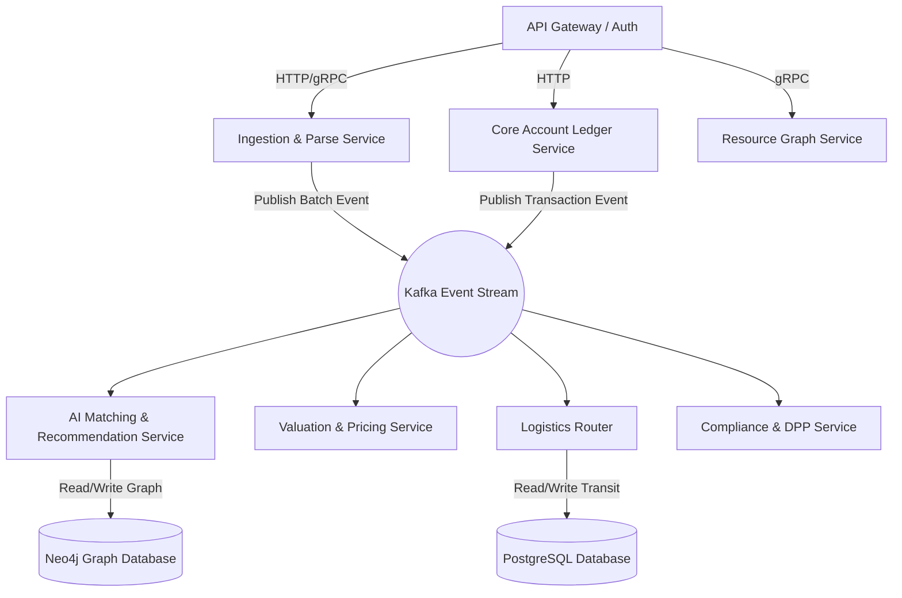

# EARTHOS AI: Technical Architecture & System Design
### The Core Architecture of the Resource Operating System

---

This document outlines the end-to-end technical architecture, data systems, AI workflows, and security frameworks for **EARTHOS AI**—the Operating System for Earth's Resources.

---

## 1. User Flow

The platform orchestrates physical movements and data handoffs between three primary actors: **Material Generators**, **Material Off-takers**, and **Logistics Providers**.

```mermaid
sequenceDiagram
    autonumber
    actor Gen as Material Generator (Plant Mgr)
    actor Off as Material Off-taker (Procurement)
    actor Carrier as Logistics Provider (3PL)
    participant OS as EARTHOS AI System

    Gen->>OS: Register Material Stream (ERP/IoT Sync)
    OS->>OS: Process SDS / Parse Chemistry (AI Engine)
    OS->>OS: Generate Material Node in Resource Graph
    OS->>OS: Identify Predictive Match (GNN + Vector Search)
    OS->>Off: Push Notification: Secondary Resource Match Found
    Off->>OS: Review Specifications & Price (Dynamic Valuation)
    Off->>OS: Accept Match & Commit Order
    OS->>OS: Trigger Logistics Route Optimizer (Co-loading Engine)
    OS->>Carrier: Dispatch Co-loading Multi-stop Manifest
    Carrier->>Gen: Pick up secondary resource batch
    Carrier->>Off: Deliver secondary resource batch
    Off->>OS: Confirm Delivery & Log Purity Certificate
    OS->>OS: Mint Digital Product Passport (DPP) & Log Carbon Metrics
```

---

## 2. Information Architecture (IA)

The information architecture is designed around physical tracking, financial execution, and compliance reporting.

```
EARTHOS AI (System Root)
├── Organization & Workspaces (Multi-Tenant Management)
│   ├── User & Team Settings (Roles, Credentials)
│   └── Facility Profiles (Geocoordinates, Storage Limits, Material Inflow/Outflow APIs)
├── Resource Registry (The Physical Layer)
│   ├── Material Streams (Continuous byproduct definitions, schedule rates)
│   ├── Inventory Batches (State, volume, storage location, chemical specifications)
│   └── Catalog of Intended Inputs (Procurement specifications, purity requirements)
├── Matchmaking & Transactions (The Exchange Layer)
│   ├── Matching Dashboard (AI proposals, compatibility indices)
│   ├── Contracts & Orders (Invoicing, billing, quality guarantees)
│   └── Settlement Hub (Payments, disputes, inspection files)
├── Logistics Dispatch (The Transit Layer)
│   ├── Route Optimization (Co-loading queues, carrier pool)
│   ├── Active Shipments (Real-time GPS, temperature/sensor logs)
│   └── Terminal Manifests (Bills of Lading, loading instructions)
├── Compliance & Impact (The Environmental Layer)
│   ├── Scope 3 Ledger (Upstream/downstream carbon offsets, virgin substitution savings)
│   ├── Digital Product Passports (Cryptographic lifecycle lineage records)
│   └── Regulatory Registry (EPR receipts, hazardous manifest generator)
└── Developer Portal (The Integration Layer)
    ├── API Integrations (SAP, Oracle, Microsoft Dynamics)
    ├── Webhook Event Dispatcher (Real-time state change webhooks)
    └── System Telemetry Logs
```

---

## 3. App Navigation

The user interface uses a sidebar-driven, workspace-centric navigation design built for operations, sustainability management, and billing.

*   **Dashboard** `/dashboard`
    *   *Global Command Center:* Multi-facility overview of material velocities, recyclability rates, active matches, and cumulative Scope 3 carbon savings.
*   **Resource Registry** `/resources`
    *   *My Streams:* Manage ongoing byproduct and input material streams.
    *   *Active Inventory:* List batches currently waiting in warehouses or silos.
    *   *Add Material:* Interface to register material via raw upload, ERP sync, or chemical Safety Data Sheet (SDS) parsing.
*   **Matchmaking Hub** `/matches`
    *   *Proposals:* High-purity matching opportunities sorted by compatibility and proximity.
    *   *Negotiation & Chat:* Bid/ask interfaces for price, volume, and shipping configurations.
    *   *Active Contracts:* Agreements currently in legal or logistics transit.
*   **Logistics Center** `/logistics`
    *   *Route Tracker:* Real-time visualization of dispatched trucks, co-loading stops, and backhaul statuses.
    *   *Carrier Registry:* Connects local third-party logistics (3PL) fleets.
    *   *Manifests:* Printable, legally compliant shipping documentation.
*   **Compliance & Analytics** `/compliance`
    *   *Carbon Accounting:* Exportable audit reports verifying Scope 3 reductions.
    *   *Product Passports:* Explore traceability lineages for manufactured products using system inputs.
    *   *Regulatory Center:* Manage hazard paperwork, custom manifests, and waste tracking receipts.
*   **Developer Settings** `/developer`
    *   *API Keys:* Manage write/read credentials.
    *   *Webhook Configurations:* Configure event triggers for ERP syncs.

---

## 4. Database Design

EARTHOS AI uses a **hybrid database architecture**:
1.  **PostgreSQL (Relational):** Manages user accounts, tenants, financial transactions, shipping contracts, and audit configurations.
2.  **Neo4j (Graph):** Implements the **Resource Graph**, modeling chemical compositions, recycling pathways, facility distances, and compatibility rules.

### PostgreSQL Schema (Simplified DDL)

```sql
-- Core Tenants & Organizations
CREATE TABLE organizations (
    id UUID PRIMARY KEY DEFAULT gen_random_uuid(),
    name VARCHAR(255) NOT NULL,
    tax_id VARCHAR(50) UNIQUE,
    created_at TIMESTAMP WITH TIME ZONE DEFAULT CURRENT_TIMESTAMP
);

-- Production & Processing Facilities
CREATE TABLE facilities (
    id UUID PRIMARY KEY DEFAULT gen_random_uuid(),
    organization_id UUID REFERENCES organizations(id) ON DELETE CASCADE,
    name VARCHAR(255) NOT NULL,
    location POINT NOT NULL, -- Latitude and Longitude coordinates
    address TEXT NOT NULL,
    created_at TIMESTAMP WITH TIME ZONE DEFAULT CURRENT_TIMESTAMP
);

-- Relational Metadata for Material Batches
CREATE TABLE material_batches (
    id UUID PRIMARY KEY DEFAULT gen_random_uuid(),
    facility_id UUID REFERENCES facilities(id) ON DELETE CASCADE,
    status VARCHAR(50) NOT NULL, -- 'PENDING', 'MATCHED', 'IN_TRANSIT', 'CONSUMED'
    initial_volume NUMERIC(12, 2) NOT NULL,
    current_volume NUMERIC(12, 2) NOT NULL,
    unit VARCHAR(10) NOT NULL, -- 'KG', 'TONS', 'LITERS'
    declared_at TIMESTAMP WITH TIME ZONE DEFAULT CURRENT_TIMESTAMP
);

-- Transaction Match Ledger
CREATE TABLE material_matches (
    id UUID PRIMARY KEY DEFAULT gen_random_uuid(),
    batch_id UUID REFERENCES material_batches(id),
    buyer_facility_id UUID REFERENCES facilities(id),
    status VARCHAR(50) NOT NULL, -- 'PROPOSED', 'ACCEPTED', 'CONTRACTED', 'COMPLETED'
    contracted_price_per_unit NUMERIC(10, 2) NOT NULL,
    currency VARCHAR(3) DEFAULT 'USD',
    created_at TIMESTAMP WITH TIME ZONE DEFAULT CURRENT_TIMESTAMP
);

-- Logistics Shipping Records
CREATE TABLE shipments (
    id UUID PRIMARY KEY DEFAULT gen_random_uuid(),
    match_id UUID REFERENCES material_matches(id),
    carrier_id UUID,
    route_json JSONB NOT NULL, -- Optimized path instructions
    carbon_emitted_g CO2 NUMERIC(12,2),
    dispatched_at TIMESTAMP,
    delivered_at TIMESTAMP
);
```

### Neo4j Graph Schema Model

```
(o:Organization)-[:OWNS]->(f:Facility)-[:PRODUCES|CONSUMES]->(s:MaterialStream)
(s)-[:CONTAINS_MATERIAL]->(b:MaterialBatch)
(b)-[:HAS_CHEMISTRY]->(c:ChemicalComponent)
(f1:Facility)-[:GEODISTANCE {miles: float}]->(f2:Facility)
```

---

## 5. APIs

The API layer is built on REST endpoints for transactional mutations and gRPC services for low-latency telemetry ingestion and matching updates.

### Core REST Endpoints

#### 1. Register a Material Batch
*   **Route:** `POST /api/v1/facilities/{facility_id}/materials`
*   **Request Body:**
```json
{
  "stream_id": "8f8b76a0-5c3a-4db3-9821-4f7db495c65a",
  "volume": 22.4,
  "unit": "TONS",
  "chemical_composition": {
    "polyethylene": 0.98,
    "moisture": 0.015,
    "contaminants": ["carbon-black", "additives"]
  },
  "safety_sheet_url": "https://storage.earthos.ai/sds/sds-poly-98.pdf"
}
```
*   **Response:** `201 Created` with UUID.

#### 2. Get AI Matching Recommendations
*   **Route:** `GET /api/v1/facilities/{facility_id}/matches?purity_threshold=0.90`
*   **Response:** `200 OK`
```json
{
  "facility_id": "f8a002bc-124b-4b10-8b43-23a54bde892a",
  "matches": [
    {
      "match_id": "77bc9d8c-4a31-419b-a010-09be7cfde83f",
      "batch_id": "a98dfb9e-64c3-4d7a-8b22-83b3e2a7e71f",
      "seller": "Varga Automotive Corp",
      "material_type": "Recycled Polyethylene",
      "volume": 22.4,
      "purity_index": 0.965,
      "distance_miles": 14.8,
      "unit_price_usd": 420.00,
      "potential_carbon_saving_tons_co2e": 12.8,
      "co_loading_efficiency_score": 0.88
    }
  ]
}
```

#### 3. Update Transit Telemetry (Carrier Webhook)
*   **Route:** `PATCH /api/v1/shipments/{shipment_id}/telemetry`
*   **Request Body:**
```json
{
  "latitude": 29.7604,
  "longitude": -95.3698,
  "temp_celsius": 21.5,
  "weight_sensor_reading": 22380.00,
  "timestamp": "2026-07-18T00:41:00Z"
}
```
*   **Response:** `200 OK`

---

## 6. AI Flow

EARTHOS AI integrates three AI systems to convert physical waste streams into structured digital transactions:

```
[Unstructured Data (SDS PDFs)]
         │
         ▼
 1. Natural Language / Document Parse (LLM)
         │
         ▼
[Structured Chemical Graphs]
         │
         ▼
 2. Matching Engine (GNN + Vector Proximity)
         │
         ▼
[Optimized Matches]
         │
         ▼
 3. Logistics Optimization (RL Constraint Solver)
         │
         ▼
[Multi-stop Co-loading Route Manifests]
```

### I. Natural Language / Document Parse Pipeline (SDS Parser)
*   **Engine:** OCR + Fine-Tuned LLM (LayoutLM / Gemini API integration).
*   **Flow:** When a plant manager uploads a Safety Data Sheet (SDS) or lab analysis PDF, the engine parses tables, text, and molecular structures to extract CAS Registry numbers, toxicity profiles, purity percentages, and physical properties.
*   **Output:** Structural JSON metadata pushed directly to the Resource Graph.

### II. Matching Engine (Graph Neural Networks + Vector Proximity)
*   **Engine:** GNNs (GraphSAGE) combined with vector search (Pgvector/Milvus vector databases).
*   **Flow:** 
    1. The target raw material input requirements of buyers are converted into multidimensional embeddings (representing CAS chemical numbers, geographic limits, and moisture maximums).
    2. Available byproduct streams are matched based on cosine similarity and graph path analysis (checking if secondary materials can be processed to match buyer purity targets).
    3. Distance constraints are injected to filter matches exceeding a threshold of carbon emissions generated in transport.

### III. Logistics Routing Optimizer (RL Constraint Solver)
*   **Engine:** Reinforcement Learning Policy + MIP (Mixed-Integer Programming) solver.
*   **Flow:** Analyzes active matches and trucks on the road. It runs simulations to group pickups of compatible byproducts onto single flatbeds/tankers (co-loading) and routes trucks to utilize return journeys (backhaul minimization).

---

## 7. Permissions (RBAC & ABAC Model)

Permissions enforce strict data borders between competitive enterprises while ensuring compliance verification.

| Role | Description | Stream Read | Stream Write | Approve Trades | View Pricing | Access System APIs |
| :--- | :--- | :---: | :---: | :---: | :---: | :---: |
| **System Admin** | Global infrastructure maintenance. | Yes | No | No | No | Yes |
| **Org Owner** | Corporate administrative manager. | Yes | Yes | Yes | Yes | Yes |
| **Sustainability Manager** | Responsible for Scope 3 audits. | Yes | No | No | Yes | No |
| **Plant Operator** | Local operations loader. | Yes (Local) | Yes (Local) | No | No | No |
| **Logistics Carrier** | Third-party carrier agent. | Only Assigned | No | No | No | Only Telemetry |
| **Compliance Auditor** | Regulatory verifier. | Audit Only | No | No | No | No |

*   **Attribute-Based Access Control (ABAC) Rule:** A user can only view chemical formulations or pricing info if the `OrganizationID` of the material matches their `UserSessionOrganizationID`, or if there is an active `material_match` record in the `PROPOSED` or `ACCEPTED` state linking the two entities.

---

## 8. Dashboards

### I. Chief Sustainability Officer (CSO) Dashboard
*   **Key Widgets:**
    *   *Real-time Circularity Index:* Percentage of feedstock sourced from secondary inputs versus virgin inputs.
    *   *Scope 3 Abatement Graph:* Dynamic trend-line showing avoided metric tons of CO2e.
    *   *DPP Lineage Visualizer:* Interactive tree diagrams showing where in-use materials are currently tracking globally.
    *   *Compliance Export Panel:* One-click Generation of CSRD-ready ESG disclosure reports.

### II. Plant Operations Manager Dashboard
*   **Key Widgets:**
    *   *Silo Fill Alerts:* Visual indicators warning when byproduct storage vessels are approaching maximum capacity.
    *   *Pending Pickups Scheduler:* Timeline view of upcoming truck dispatches.
    *   *Revenue Generation Index:* Tracking savings from diverted waste management fees and sales of byproducts.
    *   *Batch Registry Table:* Grid showing statuses of all active resource batches generated at the plant.

### III. Logistics Carrier Dispatcher View
*   **Key Widgets:**
    *   *Co-loading Map:* Map interface demonstrating multi-stop pickups, capacity optimization levels, and traffic routes.
    *   *Compatibility Warning System:* Neon warnings preventing co-loading of chemically incompatible substances (e.g., preventing food-grade polymers from sharing tanker compartments with industrial acids).
    *   *Backhaul Optimization Panel:* Notifications flagging return-trip routing opportunities.

---

## 9. Microservices Architecture

EARTHOS AI uses an event-driven microservices architecture communicating asynchronously over a **Kafka Message Bus**.



### Microservices Definitions
1.  **Ingestion & Parse Service:** Uses LLMs to OCR, clean, and structure Safety Data Sheets (SDSs) and lab tests.
2.  **Resource Graph Service:** Manages Neo4j instances, updating the relationships between materials, organizations, and facilities.
3.  **AI Matching & Recommendation Service:** GNN model running vector matches across the physical catalog.
4.  **Valuation & Pricing Service:** Evaluates global primary raw material index values (LME, Platts) and applies localization discounts.
5.  **Logistics Router:** Solves the vehicle routing problem, handles route tracking, and processes carrier telemetry hooks.
6.  **Compliance & DPP Service:** Interacts with distributed ledgers to mint Digital Product Passports and verify environmental attributes.

---

## 10. Security

Physical materials tracking requires stringent security measures to protect proprietary chemical recipes and prevent supply chain disruption.

### I. Data Encryption & Isolation
*   **In Transit:** Forced TLS 1.3 across all client-to-gateway connections and internal service communications (mTLS).
*   **At Rest:** Databases are encrypted using hardware-security modules (HSM) utilizing AES-256 keys managed by KMS.
*   **Field-Level Encryption:** Proprietary chemical formulas and additive percentages are encrypted at the field level within databases, requiring specific authorization keys.

### II. Proof of Material Provenance
*   **Digital Product Passport Verification:** Every material transfer generates a cryptographic signature. Hand-offs between generator, carrier, and buyer are signed using private keys (ECDSA) to construct an immutable chain of custody.

### III. System Resilience & Disaster Recovery
*   **Zero-Trust Identity Control:** Access to microservices is managed via transient, short-lived JSON Web Tokens (JWT) issued by an Identity Provider (IdP) supporting multi-factor authentication (MFA).
*   **DDoS Protection & Rate Limiting:** All API gateways utilize Cloudflare Magic Transit and Web Application Firewalls (WAF) to prevent system abuse and API scraping of regional material inventories.
*   **Multi-Region Failover:** High-availability deployment across three distinct availability zones to ensure the system remains active even during localized infrastructure outages.
