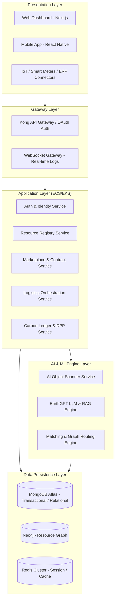
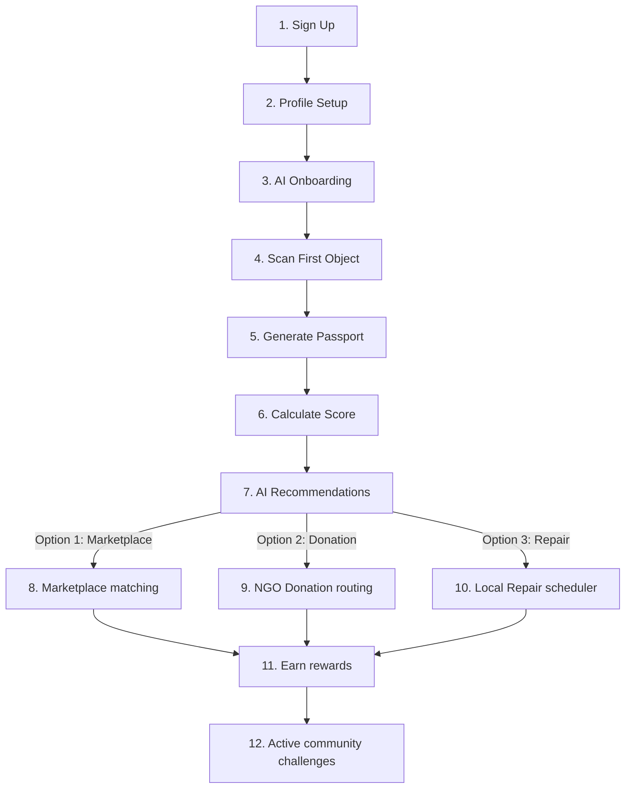
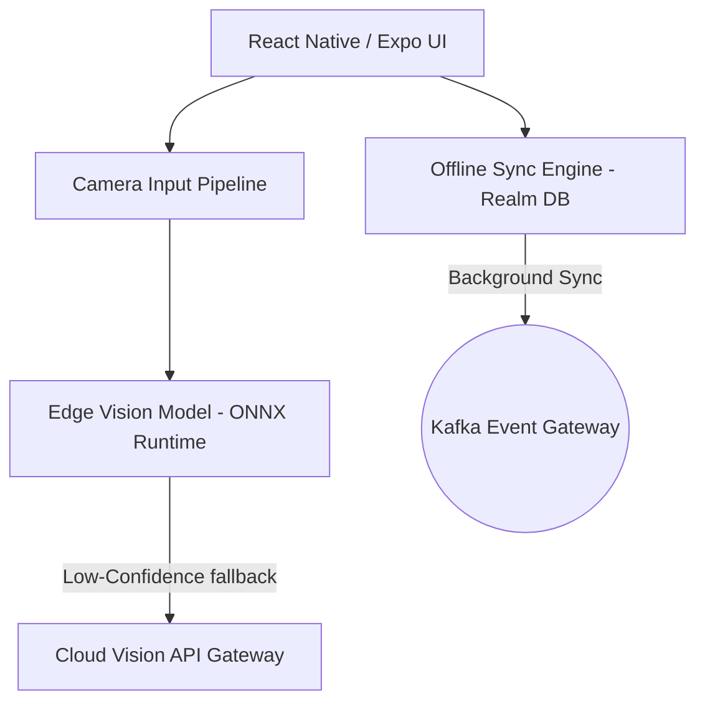
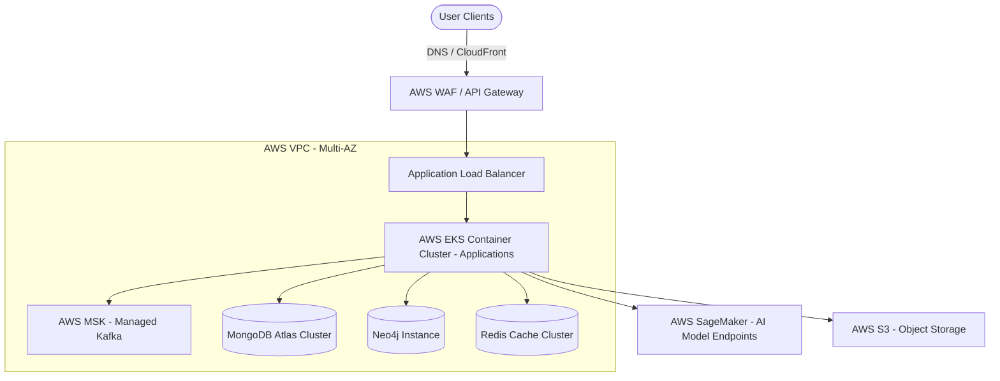

# EARTHOS AI: Product Blueprint & Technical Architecture
### The Engineering Specification for Earth's Resource OS
*Author: Chief Technology Officer*

---

This document outlines the detailed system design, cloud infrastructure, AI pipeline, database schemas, and development sequence for **EARTHOS AI**. It serves as the single source of truth for the engineering and product design teams.

---

## 1. High-Level Product Architecture

EARTHOS AI is designed using a **decoupled, event-driven microservices architecture** that separates user-facing presentation layers from heavy AI inference engines and real-time transaction processing networks.



---

## 2. Information Architecture (All Web & Mobile Pages)

### Landing Website (Unauthenticated)
```
Landing Website (Root)
├── Home (Vision, Live Abatement Stats, Startup Pitch)
├── About (Mission, Founders, YC Vision, Methodology)
├── Features (Object Scanner, DPP, Carbon Wallet, Earth Twin)
├── Marketplace (Explore Available Secondary Resources)
├── Earth Passport (DPP Search, Traceability verification)
├── EarthGPT (Intro, Developer API Docs)
├── Enterprise (Supply Chain, Scope 3 Reporting, Compliance)
├── Government (Smart City, Waste Divert Metrics, EPR)
├── Pricing (Subscription Tiers, Transaction commission tiers)
├── Blog (Sustainability insights, Case Studies)
└── Contact (Sales Inquiry, Customer Success, Developer Hub)
```

### Application Dashboard (Authenticated)
```
Dashboard Root (Dynamic view based on user role)
├── My Earth (Environmental Twin: 3D data visualization of materials)
├── My Objects (Inventory, active streams, registry portal)
│   ├── Register New Object (Upload SDS, PDF parser, AI scan)
│   └── Material Catalog (Purity reports, safety compliance details)
├── AI Scanner (Mobile camera access, batch uploading portal)
├── Earth Passport (Manage generated DPP certificates and tokens)
├── Marketplace (Reverse shopping, active matches, transaction bids)
├── Donations (NGO listings, scheduling portal, tax receipts)
├── Repairs (Local technician listings, repair manual repository)
├── Carbon Wallet (Abated carbon balance, token conversion panel)
├── EarthGPT (AI Sustainability Assistant chat interface)
├── Analytics (Usage velocities, cost savings, carbon graphs)
├── Profile (Organization metadata, verification status)
└── Settings (API integrations, Webhooks, user credentials)
```

### Mobile Application
```
Mobile App Navigation (Root Tab Navigator)
├── Home (Active scores, shortcuts, quick updates)
├── Scanner (Camera interface, instant vector-match analysis)
├── Objects (My inventory checklist, scanning queue)
├── Marketplace (Circular matches feed, buy/sell cards)
├── EarthGPT (Conversational voice/text assistant interface)
└── Profile (Identity cards, wallet status, Earth Score)
```

---

## 3. User Roles & Permissions Matrix

The platform enforces strict isolation and access management using Role-Based Access Control (RBAC) and Attribute-Based Access Control (ABAC) rules:

| Role | Object Read | Object Write | Approve matches | View Pricing | Access System APIs | View Gov Analytics | View Org Settings |
| :--- | :--- | :--- | :--- | :--- | :--- | :--- | :--- |
| **Guest** | Only Public | No | No | No | No | No | No |
| **User (Individual)**| Yes (Owned) | Yes (Owned) | Yes (Owned) | Yes (Owned) | No | No | No |
| **NGO** | Yes (Assigned) | Yes (Assigned) | Yes (Assigned) | No | No | No | No |
| **Repair Shop** | Yes (Assigned) | Yes (Assigned) | Yes (Assigned) | Yes (Assigned) | No | No | No |
| **Recycler** | Yes (Matched) | Yes (Matched) | Yes (Matched) | Yes (Matched) | Yes (Limited) | No | No |
| **Pickup Partner** | Only Manifest | No | No | No | Only Logistics | No | No |
| **Enterprise** | Yes (Org-wide) | Yes (Org-wide) | Yes (Org-wide) | Yes (Org-wide) | Yes (Full) | No | Yes |
| **Government** | Yes (Regional) | No | No | No | Yes (Reports) | Yes (Full) | No |
| **Admin** | Yes (All) | Yes (All) | Yes (All) | Yes (All) | Yes (All) | Yes (All) | Yes (All) |
| **Super Admin** | Yes (All) | Yes (All) | Yes (All) | Yes (All) | Yes (All) | Yes (All) | Yes (All) |

---

## 4. User Journey Maps



### Onboarding & Material Matching Journey
1.  **Identity Verification:** User/Enterprise completes profile setup. Enterprises verify business licenses and tax IDs.
2.  **Telemetry Ingestion:** User logs in and accesses the camera tool (mobile) or imports inventory datasets via ERP API (enterprise).
3.  **Physical Digitization:** Object is scanned or parsed. The system generates a digital asset passport mapping CAS chemical compositions.
4.  **Value Attribution:** The AI engine calculates carbon values, localized prices, and circular scores.
5.  **Autonomous Routing:** The matching engine alerts nearby buyers. A transactions workflow initiates, followed by co-loading freight routing.
6.  **Loop Closure:** The buyer confirms delivery, and the digital token registers the updated lifecycle state.

---

## 5. MongoDB Database Schema Design

EARTHOS AI uses MongoDB Atlas as its primary transactional database. The schema designs below specify key collections, types, constraints, and indexes.

### `Users` Collection
```json
{
  "_id": "ObjectId",
  "organizationId": "ObjectId (nullable)",
  "role": "String (GUEST, USER, NGO, REPAIR_SHOP, RECYCLER, ENTERPRISE, GOVERNMENT, ADMIN)",
  "email": "String (Unique, Indexed)",
  "passwordHash": "String",
  "profile": {
    "name": "String",
    "avatarUrl": "String",
    "phone": "String",
    "location": {
      "type": "String (Point)",
      "coordinates": ["Double (Longitude)", "Double (Latitude)"]
    }
  },
  "earthScore": "Integer (0-100)",
  "createdAt": "Date",
  "updatedAt": "Date"
}
```
*   *Indexes:* `{"email": 1}` (Unique), `{"profile.location": "2dsphere"}`.

### `Objects` Collection
```json
{
  "_id": "ObjectId",
  "ownerId": "ObjectId (references Users)",
  "status": "String (REGISTERED, MATCHED, IN_TRANSIT, DELIVERED, RECLAIMED)",
  "name": "String",
  "category": "String",
  "description": "String",
  "images": ["String (URLs)"],
  "chemicalComposition": {
    "polyethylene": 0.95,
    "moisture": 0.05
  },
  "hazardClassification": "String",
  "estimatedValue": "Decimal128",
  "carbonFootprintKgCO2e": "Decimal128",
  "registeredAt": "Date"
}
```
*   *Indexes:* `{"ownerId": 1}`, `{"status": 1}`, `{"category": 1}`.

### `EarthPassports` Collection (Digital Product Passport)
```json
{
  "_id": "ObjectId",
  "objectId": "ObjectId (references Objects, Unique)",
  "dppToken": "String (Cryptographic Hash, Indexed)",
  "manufactureOrigin": "String",
  "materialLineage": [
    {
      "stage": "String",
      "timestamp": "Date",
      "facilityId": "ObjectId",
      "verifiedBy": "String"
    }
  ],
  "purityCertificateUrl": "String",
  "complianceCertificates": ["String"],
  "generatedAt": "Date"
}
```
*   *Indexes:* `{"dppToken": 1}` (Unique), `{"objectId": 1}` (Unique).

### `Repairs` Collection
```json
{
  "_id": "ObjectId",
  "objectId": "ObjectId (references Objects)",
  "repairShopId": "ObjectId (references Users)",
  "issueDescription": "String",
  "estimatedCost": "Decimal128",
  "scheduledDate": "Date",
  "status": "String (REQUESTED, SCHEDULED, IN_PROGRESS, COMPLETED, CANCELLED)",
  "warrantyPeriodMonths": "Integer",
  "createdAt": "Date"
}
```
*   *Indexes:* `{"repairShopId": 1}`, `{"status": 1}`.

### `Donations` Collection
```json
{
  "_id": "ObjectId",
  "objectId": "ObjectId (references Objects)",
  "donorId": "ObjectId (references Users)",
  "ngoId": "ObjectId (references Users)",
  "pickupManifestId": "ObjectId (references Shipments, nullable)",
  "status": "String (PENDING_APPROVAL, ARRANGED, COLLECTED, DELIVERED)",
  "taxReceiptUrl": "String",
  "createdAt": "Date"
}
```
*   *Indexes:* `{"ngoId": 1}`, `{"donorId": 1}`.

### `Marketplace` Collection
```json
{
  "_id": "ObjectId",
  "objectId": "ObjectId (references Objects)",
  "sellerId": "ObjectId (references Users)",
  "buyerId": "ObjectId (references Users, nullable)",
  "listingType": "String (SALE, TRADE, REQUEST)",
  "price": "Decimal128",
  "currency": "String (default USD)",
  "status": "String (ACTIVE, RESERVED, SOLD, WITHDRAWN)",
  "matchedAt": "Date (nullable)",
  "createdAt": "Date"
}
```
*   *Indexes:* `{"status": 1}`, `{"price": 1}`, `{"sellerId": 1}`.

### `CarbonWallet` Collection
```json
{
  "_id": "ObjectId",
  "userId": "ObjectId (references Users, Unique)",
  "balanceCredits": "Decimal128",
  "transactions": [
    {
      "transactionId": "ObjectId",
      "amount": "Decimal128",
      "type": "String (CREDIT, DEBIT)",
      "description": "String",
      "timestamp": "Date"
    }
  ],
  "lastUpdatedAt": "Date"
}
```
*   *Indexes:* `{"userId": 1}` (Unique).

### `AIPredictions` Collection
```json
{
  "_id": "ObjectId",
  "objectId": "ObjectId (references Objects)",
  "predictionType": "String (LIFE_EXPECTANCY, WASTE_MATCHING, CARBON_SAVING)",
  "confidenceScore": "Double (0.0-1.0)",
  "predictionMetadata": "Document (Variant fields)",
  "runAt": "Date"
}
```
*   *Indexes:* `{"objectId": 1}`, `{"predictionType": 1}`.

### `Rewards` Collection
```json
{
  "_id": "ObjectId",
  "userId": "ObjectId (references Users)",
  "rewardPoints": "Integer",
  "activityType": "String (SCAN, DONATION, REPAIR, MARKETPLACE_SALE)",
  "associatedEntityId": "ObjectId",
  "earnedAt": "Date"
}
```

### `Communities` Collection
```json
{
  "_id": "ObjectId",
  "name": "String",
  "region": "String",
  "memberIds": ["ObjectId (references Users)"],
  "totalCo2Abated": "Decimal128",
  "createdAt": "Date"
}
```

### `Challenges` Collection
```json
{
  "_id": "ObjectId",
  "title": "String",
  "description": "String",
  "communityId": "ObjectId (references Communities)",
  "targetMetric": "String (CO2_KG, TONS_DIVERTED, OBJECTS_SCANNED)",
  "targetValue": "Decimal128",
  "currentProgress": "Decimal128",
  "startDate": "Date",
  "endDate": "Date"
}
```

### `GovernmentReports` Collection
```json
{
  "_id": "ObjectId",
  "governmentOrgId": "ObjectId (references Users)",
  "region": "String",
  "divertedTons": "Decimal128",
  "landfillSavingsUsd": "Decimal128",
  "timeframe": "String (MONTHLY, QUARTERLY, ANNUAL)",
  "generatedAt": "Date"
}
```

### `EnterpriseReports` Collection
```json
{
  "_id": "ObjectId",
  "enterpriseId": "ObjectId (references Users)",
  "scope3ReductionKgCO2e": "Decimal128",
  "materialEfficiencyIndex": "Double",
  "auditHash": "String (Cryptographic verification hash)",
  "generatedAt": "Date"
}
```

### `Notifications` Collection
```json
{
  "_id": "ObjectId",
  "recipientId": "ObjectId (references Users)",
  "type": "String (MATCH_FOUND, DELIVERY_CONFIRMED, WALLET_CREDIT)",
  "title": "String",
  "message": "String",
  "read": "Boolean (default false)",
  "createdAt": "Date"
}
```
*   *Indexes:* `{"recipientId": 1, "read": 1}`.

### `ChatHistory` Collection
```json
{
  "_id": "ObjectId",
  "sessionId": "String (Indexed)",
  "participants": ["ObjectId (references Users)"],
  "messages": [
    {
      "senderId": "ObjectId (references Users)",
      "message": "String",
      "timestamp": "Date"
    }
  ]
}
```
*   *Indexes:* `{"sessionId": 1}`.

---

## 6. REST API Architecture

All endpoints enforce SSL/TLS, standard headers (`Authorization: Bearer <JWT>`), and respond with standard JSON format.

```
/auth
  ├── POST   /signup                  -> Register a new user/organization
  └── POST   /login                   -> Authenicate and return JWT token
/objects
  ├── GET    /                        -> List owned/accessible objects (with pagination)
  ├── POST   /                        -> Register a new object
  ├── GET    /:id                     -> Retrieve details of a specific object
  └── DELETE /:id                     -> Remove object registration
/passport
  └── GET    /:id                     -> Fetch Digital Product Passport details
/scanner
  └── POST   /                        -> Upload image/data for AI object scanning
/marketplace
  ├── GET    /                        -> Search active marketplace listings
  └── POST   /listings                -> Create a marketplace listing
/donate
  ├── POST   /                        -> Initiate a donation flow
  └── GET    /ngos                    -> Query verified local NGOs
/repair
  ├── POST   /                        -> Book a repair shop service
  └── GET    /shops                   -> Query verified local repair technicians
/dashboard
  └── GET    /metrics                 -> Fetch contextual dashboard stats
/earth-score
  └── GET    /                        -> Retrieve current profile Earth Score & details
/earthgpt
  └── POST   /chat                    -> Send input query to EarthGPT LLM session
```

---

## 7. AI System Architecture

The AI layer processes image inputs, textual specs, and spatial graphs to coordinate resource flows.

```
   ┌────────────────────────────────────────────────────────┐
   │                  AI ARCHITECTURE TIERS                 │
   ├────────────────────────────────────────────────────────┤
   │  Computer Vision: YOLOv8 (Detect) -> ViT (Classify)    │
   ├────────────────────────────────────────────────────────┤
   │  NLP & Knowledge: LLM (Gemini/Llama) -> RAG Vector DB  │
   ├────────────────────────────────────────────────────────┤
   │  Predictive Graph: GraphSAGE GNN -> Constraint Solver  │
   └────────────────────────────────────────────────┘
```

1.  **AI Object Scanner:** Combines **YOLOv8** for bounding-box isolation with a fine-tuned **Vision Transformer (ViT)** classifier to identify material classes and specific objects.
2.  **EarthGPT:** Sustainability-focused LLM using **Retrieval-Augmented Generation (RAG)** linked to local environmental compliance codes and material repair guides.
3.  **Waste Prediction:** Survival analysis regression models forecasting when an asset's utility drops below usability thresholds based on material properties and wear logs.
4.  **Repair Recommendation:** Graph search models mapping object fault indicators to local repair manuals and component availability indexes.
5.  **Donation Recommendation:** Spatial clustering algorithm matching donor locations with NGO demand profiles, minimizing logistics paths.
6.  **Marketplace Matching:** Two-sided vector database ranking engine matching byproduct characteristics with manufacturing procurement criteria.
7.  **Carbon Calculator:** Ingestion engine mapping material compositions to life-cycle assessment (LCA) databases (e.g., Ecoinvent) to calculate net abated carbon.
8.  **Earth Twin (3D Env Twin):** Utilizes **3D Gaussian Splatting** / NeRF models to convert photo sequences into interactive 3D visualizations of spatial resources.
9.  **Duplicate Detection:** Custom image hashing algorithm (Difference Hash) combined with vector comparison to identify duplicate scans of identical physical objects.
10. **Life Prediction:** An ensemble regression model (XGBoost) predicting remaining lifetime value based on brand durability records and environmental conditions.

---

## 8. Dashboard Architecture

### I. Individual User Dashboard
*   **Purpose:** Gamification and domestic circularity.
*   **Modules:** Personal Environmental Twin, Earth Score card, local repair/donations map, and carbon credit balance.

### II. NGO Dashboard
*   **Purpose:** Logistics coordinate matching and demand management.
*   **Modules:** Real-time demand checklist, scheduled pickup calendar, logistics routing, and tax receipt generator.

### III. Repair Shop Dashboard
*   **Purpose:** Service management and manual lookup.
*   **Modules:** Incoming repair queue, diagnostic manual parser, component order ledger, and customer scheduler.

### IV. Recycler Dashboard
*   **Purpose:** Inflow tracking and processing logs.
*   **Modules:** Inbound volume forecast, purity verification checks, sorting queue, and processing status logs.

### V. Enterprise Dashboard
*   **Purpose:** Audit-ready Scope 3 management.
*   **Modules:** Real-time materials ledger, carbon credit marketplace interface, DPP certificate management, and CSRD/GRI compliance exporter.

### VI. Government Dashboard
*   **Purpose:** City environmental overview and route optimization analytics.
*   **Modules:** Regional material velocity graphs, smart city waste diversion metrics, EPR compliance tracking, and public sector fleet route indicators.

### VII. Admin Dashboard
*   **Purpose:** Identity management and network integrity controls.
*   **Modules:** Organization verification queue, transaction dispute manager, system health dashboard, and model telemetry monitoring.

---

## 9. Mobile Application Architecture

The mobile app is optimized for scanning and offline usability.



*   **Offline-First Sync Engine:** Utilizes **Realm DB** to store scanned objects and active inventory updates locally. Syncs to cloud database asynchronously when connection is recovered.
*   **Camera Pipeline:** Employs **ONNX Runtime Mobile** to run lightweight object detection models locally on the device (Edge AI). If classification confidence falls below 85%, the image is compressed and sent to the cloud model.

---

## 10. Authentication & Security Architecture

```
                 API GATEWAY SECURITY FRAMEWORK
    [TLS 1.3/HTTPS] ──► [WAF Shield] ──► [Rate Limiter] 
                                                │
                                                ▼
    [Signed Certificates] ◄── [JWT Validation] ◄─┘
```

*   **Authentication Flow:** Auth0 / custom OAuth2 OIDC provider issuing RS256-signed JSON Web Tokens (JWT) containing role-based claims.
*   **Rate Limiting:** IP and API-Key based bucket limiters managed in Redis (standard limits: 100 req/min for public API, 10,000 req/min for authenticated enterprises).
*   **Content Validation:** Input images are scanned via Amazon Rekognition to filter inappropriate content and stripped of EXIF metadata to protect user location privacy.
*   **Encryption Keys:** Database elements use field-level envelope encryption. Cryptographic operations leverage keys securely managed in AWS Key Management Service (KMS).

---

## 11. Cloud Infrastructure Architecture

Deployed globally on AWS using Infrastructure-as-Code (Terraform) across multiple Availability Zones.



---

## 12. Notification Architecture

*   **Event Broker:** Managed Kafka (AWS MSK). Real-time message events are pushed to topics (e.g., `object-registered`, `match-proposed`).
*   **WebSocket Gateway:** Dedicated service nodes running Socket.io for active client connections.
*   **Push Delivery:** Integrated with Firebase Cloud Messaging (FCM) and Apple Push Notification Service (APNs).
*   **Fallback Channel:** AWS SES (Email) and Twilio (SMS) process alerts if WebSocket/Push channels fail to return a delivery confirmation status.

---

## 13. File Storage Architecture

*   **Storage Provider:** AWS S3 buckets.
*   **Bucket Segregation:**
    *   `earthos-public-assets`: Open access for landing resources.
    *   `earthos-user-scans`: Strictly secure private storage requiring presigned upload/download URLs.
    *   `earthos-compliance-docs`: WORM (Write Once, Read Many) bucket policy to protect audit logs from mutation.
*   **Caching & Archive:** CloudFront CDN caching for user scans (with token access). Automatically archives image records older than 180 days to AWS Glacier to control storage overhead.

---

## 14. Analytics Architecture

*   **Event Pipeline:** Snowplow collectors gather client events, pushing data to AWS Kinesis.
*   **Storage Warehouse:** Google BigQuery / AWS Snowflake handles complex historical data.
*   **Processing Engine:** Apache Spark and dbt run scheduled overnight transformations to update enterprise and government sustainability index stats.

---

## 15. Scalability Plan

```
             SCALABILITY INFRASTRUCTURE REQUIREMENTS
 ┌──────────────────────┬──────────────────────┬──────────────────────┐
 │      100K Users      │       1M Users       │      10M Users       │
 ├──────────────────────┼──────────────────────┼──────────────────────┤
 │ Single Region Atlas  │ Multi-Region Atlas   │ Sharded Database     │
 │ Redis Session Store  │ Redis Caching Layer  │ Edge-AI Processing   │
 │ Multi-node ECS Cluster│ EKS Kubernetes Auto  │ Kafka Routing Bus    │
 └──────────────────────┴──────────────────────┴──────────────────────┘
```

### I. 1K Users (Proof of Concept)
*   **DB:** Shared MongoDB Atlas M10 instance.
*   **Compute:** Render / single AWS EC2 instances running Docker.
*   **AI:** Local API calls to OpenAI/Gemini; cold starts are acceptable.

### II. 100K Users (Growth Phase)
*   **DB:** MongoDB Atlas M30 replica set.
*   **Compute:** AWS ECS (Fargate) with auto-scaling triggers.
*   **AI:** Dedicated SageMaker endpoints for YOLOv8 scanner; standard RAG vector database.

### III. 1M Users (Scale Phase)
*   **DB:** MongoDB Atlas cluster with read-replicas. Redis cache layer implemented for active inventory queries.
*   **Compute:** AWS EKS (Kubernetes) managing auto-scaling pods.
*   **AI:** Custom GPU compute nodes for image matching; decentralized RAG processing.

### IV. 10M Users (Infrastructure Level)
*   **DB:** MongoDB cluster partitioned by geographic region.
*   **Compute:** Multi-region, active-active EKS setups.
*   **AI:** Local Edge AI processing for mobile scanner pipelines; dedicated cluster management for the global resource graph.

---

## 16. MVP Feature List (College Project / Proof of Concept)

1.  **Basic Authentication:** Email and password login using JWT.
2.  **AI Object Scanner:** Web-based image upload sending files to a basic classification API.
3.  **Manual Object Registry:** Form interface to register resource attributes (name, category, weight).
4.  **Basic Earth Passport:** Automatically generates a read-only material status page based on scanner output.
5.  **Simple Dashboard:** Table showing active inventory items, registered carbon weights, and basic totals.
6.  **Static Marketplace Feed:** List showing items marked "For Sale" or "Free" by other users.
7.  **Simple EarthGPT:** Chat page connected directly to the Gemini API without custom RAG integration.

---

## 17. Startup Feature List (Commercial MVP)

1.  **Verified Enterprise Onboarding:** Integrates with business databases and checks tax IDs during signup.
2.  **Automated ERP Data Sync:** Initial CSV import tools and REST APIs for SAP and NetSuite inventories.
3.  **Advanced AI Scanner:** Deep YOLOv8 scanner detecting individual materials and estimating weights.
4.  **Reverse Marketplace Engine:** Real-time, automated matching between industrial byproduct streams and buyer specifications.
5.  **Smart Donation Router:** Automatically matches donor locations with NGO demand profiles, coordinating pickup routes.
6.  **Verified Carbon Wallet:** Calculates carbon values against validated LCA databases.
7.  **Mobile Applications:** iOS and Android clients featuring offline synchronization and edge-based AI scanning.

---

## 18. Unicorn Roadmap (Global Scale)

1.  **Global Carbon Exchange Integration:** Integrates our Carbon Wallet with compliance-grade carbon offset exchanges.
2.  **Autonomous Sortation Networks:** Plugs into smart city recycling systems, matching sorting criteria to real-time industrial demand.
3.  **Molecular AI Chemistry Recommendations:** Generative chemistry models suggest additives to upgrade secondary inputs to meet buyer purity requirements.
4.  **Off-Planet Resource Routing OS:** Extends system capability to support off-world habitats requiring closed-loop resource management.

---

## 19. Microservices Architecture (Future Transition)

As systems scale, services partition into isolated boundaries communicating via gRPC:

```
  ┌────────────────────────────────────────────────────────┐
  │                   MICROSERVICES SPLIT                  │
  ├────────────────────────────────────────────────────────┤
  │ User Identity Service ──[gRPC]──► Account Management   │
  │ Resource Registry ─────[gRPC]──► Inventory & Passports │
  │ Matchmaking Engine ────[gRPC]──► Dynamic Routing       │
  │ Transaction Engine ────[gRPC]──► Contract Ledger       │
  │ Logistics & Dispatch ──[gRPC]──► Carrier Coordination   │
  └────────────────────────────────────────────────────────┘
```

*   **Database Isolation:** Each service maintains its own MongoDB database instance, preventing dependencies. Data consistency across services is managed asynchronously via Kafka events.

---

## 20. Complete Development Sequence

```
          MILESTONE IMPLEMENTATION TIMELINE
 ┌──────────────────────────────────────────────┐
 │ M1: Infrastructure Setup (W1-W4)             │
 ├──────────────────────────────────────────────┐
 │ M2: Ingestion & Scanner Engine (W5-W8)       │
 ├──────────────────────────────────────────────┐
 │ M3: Matching Engine & Marketplace (W9-W12)   │
 ├──────────────────────────────────────────────┐
 │ M4: Logistics & Compliance (W13-W16)         │
 ├──────────────────────────────────────────────┐
 │ M5: QA, Audits, Launch (W17-W20)             │
 └──────────────────────────────────────────────┘
```

### Milestone 1: Core Foundation & Infrastructure (Weeks 1 - 4)
*   **Goal:** Setup network systems, authentication, and core database layouts.
*   **Deliverables:**
    *   Deploy AWS VPCs, ECS clusters, and MongoDB Atlas databases via Terraform.
    *   Develop the Authentication Service (JWT validation, OIDC setups).
    *   Implement user registration, onboarding paths, and multi-tenant workspaces.

### Milestone 2: Object Ingestion & AI Scanner Engine (Weeks 5 - 8)
*   **Goal:** Build digitization pipelines and image parser engines.
*   **Deliverables:**
    *   Write the file storage engine (AWS S3 bucket rules, presigned URLs).
    *   Develop the AI Scanner Service (deploy YOLOv8 endpoints on SageMaker).
    *   Implement PDF parsers to extract Cas Registry chemical codes from Safety Data Sheets.
    *   Launch the Digital Product Passport (DPP) generation engine.

### Milestone 3: Matchmaking & Transactional Systems (Weeks 9 - 12)
*   **Goal:** Activate commerce and predictive matching.
*   **Deliverables:**
    *   Deploy Neo4j graph instances mapping physical objects and compatibility links.
    *   Write the vector matching algorithm using Pgvector/Milvus.
    *   Implement listing controls and order management workflows in the Reverse Marketplace.
    *   Set up dynamic price valuations linked to commodity index streams.

### Milestone 4: Logistics Co-loading & Compliance Tracking (Weeks 13 - 16)
*   **Goal:** Coordinate transportation and environmental auditing.
*   **Deliverables:**
    *   Implement the logistics route optimizer (co-loading pooling models).
    *   Connect third-party logistics (3PL) telemetry webhooks.
    *   Develop the Carbon Wallet calculation logic and logging systems.
    *   Generate exportable, audit-ready compliance reports (CSRD/GRI).

### Milestone 5: End-to-End QA, Safety Audits, & Launch (Weeks 17 - 20)
*   **Goal:** Finalize security checks and release the system.
*   **Deliverables:**
    *   Conduct end-to-end integration tests on the microservices network.
    *   Perform penetration tests and security checks on JWT tokens and APIs.
    *   Audit compliance manifests with regional regulatory partners.
    *   Release mobile apps to app stores and launch the enterprise dashboard.
